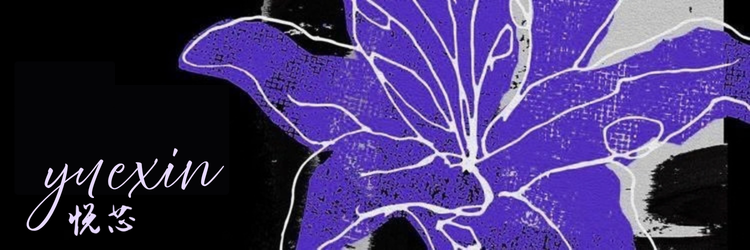

#  *yuexin*

hi hi, I'm yuexin!

I'm a self-taught software engineer, game and web dev from  france!

##  *currently making*

A website inspired by [Speedrun.com](https://www.speedrun.com "See Speedrun.com")
which hosts speedruns for Polytoria games, with contests and competitions that
would grant free rewards...

The networking and backend side of things on an unannounced game
engine project...

##  *tech stack*

### *engine / game dev*

  
  
  
  
  
  

### *web dev*

  
  
  
  

### *other*

  

